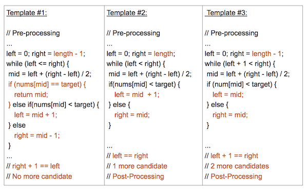

# Binary search

## Template #1 (left <= right)
- 基本用法
- 不需後處理
- 迴圈中直接取得目標

## Template #2 (left < right)
- 進階用法
- 需後處理
- 搜尋區間至少需有2個以上元素
- left和right收斂在同一元素，該元素需另外判斷

## Template #3 (left + 1 < right)
- 延伸用法
- 需後處理
- 搜尋區間至少需有3個以上元素
- left和right收斂在左右兩元素，該兩元素需另外判斷
